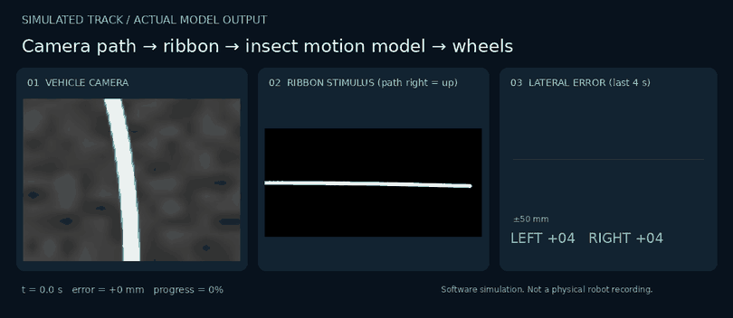

<div align="center">

# FlyBrain Track Follower

**Camera path following for robots and drones, built on an insect-inspired robot bridge.**


[](https://github.com/nxmpy/flybrain-track-follower/actions/workflows/test.yml)
[](LICENSE)


[Quick start](#quick-start) · [How it follows](#how-it-follows) · [Results](#measured-results) · [Drones](#drones-and-other-vehicles) · [Upstream bridge](#upstream-bridge)

</div>

A fork of [flybrain-robot-bridge](https://github.com/Frankweb33/flybrain-robot-bridge)
that makes robots and drones follow a path: a line, tape track, lane edge or
any bright (or dark) stripe the camera can see.



*Generated from the actual encoder, insect motion model, controller and motor
decoder in a closed-loop simulation. Not a physical robot recording.*

## Where the idea came from

The [beedictor research](docs/TRACK_FOLLOWING.md#the-research-behind-it) showed a
Drosophila connectome a price chart drawn as a white ribbon on black. Its cursor
sat on the line (rho 0.84-0.91), always one step behind, and could not predict
where the line went next. **A follower, not a predictor.** Price forecasting needs
prediction; path following only needs to stay on the line. This project takes the
follower and gives it a track.

Checking *why* it followed turned out to matter (details in
[docs/TRACK_FOLLOWING.md](docs/TRACK_FOLLOWING.md)):

- Each observation placed the cursor on the last price before the brain ran.
  That placement carried the following: rho(start, final) = 0.93, while the brain's
  own move against the real price move was rho ≈ 0.005.
- Under the research simulator the connectome's T4/T5 motion cells fire at the same
  rate for up and down motion (`scripts/grating_test.py`).

So here, as in the research, the **follower is the placement on the line**,
done by reading the path out of each camera frame. A Hassenstein-Reichardt motion
detector (the textbook model of the fly's T4/T5 computation) runs on the same
stimulus and adds its motion signal. The research connectome is included as an
experimental backend with its control arms, so it can be retested honestly.

## Quick start

Requires Python 3.11+. No robot, camera, network or connectome download needed.

```bash
git clone https://github.com/nxmpy/flybrain-track-follower.git
cd flybrain-track-follower
python3.11 -m venv .venv && source .venv/bin/activate
pip install -e ".[dev]"
python -m flybrain_robot.main --backend optomotor-track --synthetic-track --steps 1500
```

This drives a simulated differential-drive robot along a random 8 m curvy track
and prints a summary such as `rms_error_m=0.0145 completion=0.99 lost_frames=0`.

```bash
# other simulated courses
python -m flybrain_robot.main --backend optomotor-track --synthetic-track --track-kind sine --steps 2000
# a webcam or a recorded video of a line track (dry-run: nothing is sent)
python -m flybrain_robot.main --backend optomotor-track --camera 0
python -m flybrain_robot.main --backend optomotor-track --video line_track.mp4
# black tape on a light floor
printf 'track_polarity: dark\n' > config.yaml
```

## How it follows

`Camera → PathRibbonEncoder → track brain → TrackController → MotorDecoder → UDP`

1. **Find the path.** The lower part of the image is scanned row by row for the
   brightest (or darkest) stripe, giving the path's lateral position at several
   look-ahead distances and a confidence.
2. **Draw it as the research chart.** Those positions become a 160x320 white ribbon
   on black. Near rows are on the left, the look-ahead is on the right, and path
   to the right of the vehicle is drawn up. Between camera frames the ribbon moves
   in sub-steps so motion detectors see continuous movement.
3. **Follow.** Each frame the cursor is placed on the measured path
   (`track_anchor`), then the motion model moves it by what it sees.
4. **Steer.** `turn = kp * lateral + kd * motion`. It is sent as left/right wheel
   activity through the upstream decoder (limits, smoothing, watchdog) or as a
   `track_command` datagram. If the path is lost for `track_lost_frames` frames,
   the vehicle gets an emergency stop.

Backends:

| backend | brain | needs | rate |
|---|---|---|---|
| `optomotor-track` | Hassenstein-Reichardt correlator array | NumPy | ~100-150 Hz |
| `connectome-track` | beedictor connectome simulator + T4/T5 cursor (**experimental**) | `pip install -e ".[connectome]"`, a prepared `.npz` | 6-12 Hz |

## Measured results

Simulation, defaults unless stated. Reproduce with the commands in
[docs/TRACK_FOLLOWING.md](docs/TRACK_FOLLOWING.md#reproducing-the-numbers).

**Open loop: does the brain's own motion signal track path motion?**
(`scripts/open_loop_test.py`, anchor off)

| brain | Spearman rho | rate |
|---|---|---|
| Reichardt motion model | **0.78** | 146 Hz |
| male connectome, real wiring | 0.08 | 12 Hz |
| male connectome, random wiring | 0.03 | 6 Hz |

**Closed loop: 8 m curvy tracks (3 seeds) and a sine course, all completed**

| setting | RMS lateral error |
|---|---|
| placement only (`track_kd: 0`) | 7.8-21 mm |
| placement + Reichardt motion term (default `kd 0.3`) | 7.8-24 mm |
| placement + Reichardt, heavy motion weight (`kd 1.0`) | 12-30 mm |

**Closed loop: connectome arms on the same curvy track (450 frames)**

| setting | RMS error | max error |
|---|---|---|
| placement only | 4 mm | 7 mm |
| placement + real connectome | 35 mm | 108 mm |
| placement + random-wired connectome | 5 mm | 11 mm |
| real connectome without placement | lost the track | |

In other words, the insect motion model senses path motion well, but in this
simulator it does not improve steering over placement alone. The connectome, as
simulated, adds error. These are simulation numbers only.

## Drones and other vehicles

Ground robots use the upstream `motor_command` (left/right). Anything else, such
as a drone companion computer or a steering servo, can use `--output track`:

```json
{"type":"track_command","sequence":42,"forward":14.2,"yaw_rate":-6.1,"lateral":-0.18,"confidence":0.94,"emergency_stop":false}
```

`forward` and `yaw_rate` use the same -100..100 scale as `max_speed`, and
`yaw_rate > 0` means turn right. `lateral` is the path offset (-1 left .. +1
right), and `confidence` is the fraction of look-ahead rows where the path was
found. A drone should map these to body-frame velocity and yaw-rate setpoints in
its own autopilot and hold position when `emergency_stop` is true. No MAVLink
bridge is included; see [docs/TRACK_FOLLOWING.md](docs/TRACK_FOLLOWING.md#drones).

```bash
cp config.example.yaml config.yaml   # set robot_ip/ports, backend: optomotor-track, output: track
python -m flybrain_robot.main --camera 0 --config config.yaml --send
```

## Upstream bridge

Everything from flybrain-robot-bridge still works unchanged: the mock backend,
optical-flow encoder, IMU telemetry, UDP protocol and watchdog, and the firmware
scaffold.

```bash
python -m flybrain_robot.main --backend mock --synthetic
```

See [architecture and protocol](docs/ARCHITECTURE.md),
[hardware notes](docs/HARDWARE.md) and the
[firmware scaffold](firmware/atom_matrix/README.md). The firmware is disarmed
and untested on hardware.

## Repository structure

```text
src/flybrain_robot/track/            Path encoder, track brains, controller, simulator, metrics
src/flybrain_robot/track/connectome/ Connectome engine, retina and T4/T5 cursor from beedictor
src/flybrain_robot/                  Upstream CLI, vision, protocol, decoder, configuration
scripts/                             Open-loop follow test and grating direction test
examples/                            Demo GIF renderers
tests/                               Upstream checks plus track tests
docs/TRACK_FOLLOWING.md              Pipeline, research audit, drone packet, reproduction
```

## Limitations

- Only simulated tracks and a synthetic video were tested. There has been no
  physical robot or drone run.
- The path finder picks one stripe per row, preferring the one nearest its
  previous estimate. Junctions, gaps, glare, shadows and a second line nearby
  are not handled robustly.
- The simulated camera is an ideal top-down patch with no perspective, blur,
  latency or lighting change.
- The connectome backend is too slow for real-time control on one CPU core and
  does not track in the current engine.
- UDP has no authentication or delivery guarantee.

## Safety

Start in dry-run, then test with wheels lifted or propellers removed. Keep an
independent motor or power cutoff and a receiver-side watchdog. A path follower
does not detect obstacles, people or drop-offs. For drones, fly only in a
controlled area with the autopilot's own failsafes enabled.

## Development

```bash
ruff check .
pytest -q                      # connectome test runs if ../bee/data/processed/*.npz exists
python scripts/open_loop_test.py
pip install -e ".[demo]" && python examples/render_track_demo.py
```

## License and attribution

[MIT](LICENSE). Upstream bridge © 2026 Himas1211. The connectome engine, retina
mapping and cursor readout are adapted from the beedictor research project; see
[NOTICE](NOTICE). Connectome datasets (FlyWire FAFB, Janelia MaleCNS) are not
bundled and keep their own terms. Scientific sources and related community
projects are credited in the
[upstream README](https://github.com/Frankweb33/flybrain-robot-bridge#readme).
